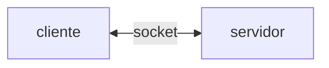
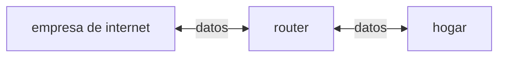

## Índice de Contenidos
0. [Introducción. ¿Por qué Encore?](#introducción-por-qué-encore)
1. [Primera etapa. Entendiendo el módulo `http`: servidores, solicitudes y respuestas](#primera-etapa-entendiendo-el-módulo-http-servidores-solicitudes-y-respuestas)
    - [Sobre `createServer`](#sobre-createserver)
    - [Observando una request](#observando-una-request)
    - [Observando una response](#observando-una-response)
    - [Analizando encabezados de una solicitud y de una respuesta](#analizando-encabezados-de-una-solicitud-y-de-una-respuesta)
2. [Segunda etapa. Creando nuestra clase principal](#segunda-etapa-creando-nuestra-clase-principal)
3. [Tercera etapa. Implementando un enrutador simple](#tercera-etapa-implementando-un-enrutador-simple)
    - [Definiendo endpoints](#definiendo-endpoints)
4. [Cuarta etapa. Middlewares](#cuarta-etapa-middlewares)
5. [Quinta etapa. Leyendo el body de una request](#quinta-etapa-leyendo-el-body-de-una-request)
6. [Sexta etapa. Rutas dinámicas y más métodos HTTP](#sexta-etapa-rutas-dinámicas-y-más-métodos-http)
7. [Séptima etapa. Publicando Encore en npm](#séptima-etapa-publicando-encore-en-npm)

---
## Introducción. ¿Por qué Encore?
Habitualmente, cuando desarrollamos aplicaciones backend, utilizando algún módulo como Express.js o Nest.js. ¿Podríamos desarrollar backend con el módulo nativo de Node.js? Sí, claro, pero una librería como Express tiene muchas otras funcionalidades y además nos ahorran trabajo. 

Ahora bien, ¿qué pasa en el "detrás de escena" cuando hacemos algo como esto?

```javascript
import express from "express"

const app = express()
```

Para entender qué está pasando acá, *desarrollar un pequeño framework*, es decir, desarrollar algo como Express, es una muy buena opción. Se trata de un ejercicio interesante porque nos obliga a pensar funcionalidades que en módulos como Express o Nest ya están perfectamente implementadas. No se trata de "reiventar la rueda" sino de analizar el detrás de escena para entender mejor qué está pasando cuando utilizamos una librería. Esta idea es comparable, un poco, a la diferencia entre saber **manejar** y saber **cómo funciona un auto**. Por supuesto que, en la mayoría de los casos, entender cómo manejar es suficiente. Pero si queremos ir más allá, nos esperan otros desafíos: podemos saber cómo hacer un cambio (análogamente, podemos saber cómo levantar un servidor en Express), pero entender *cómo funciona* la maquinaria para que el cambio se produzca efectivamente (por ejemplo, cómo se mapean las rutas, siguiendo nuestra analogía) nos aporta un tipo de conocimiento diferente y muy valioso. Por supuesto, si vamos "para atrás" en los niveles de abstracción, podríamos preguntarnos cómo funciona el módulo `http`, cómo funciona Node, cómo está desarrollado el propio JavaScript... Esos niveles de abstracción son fascinantes pero escapan al objetivo de este proyecto. 

Esta documentación toma una decisión pedagógica importante que vale la pena aclarar. A lo largo de esta documentación, iremos haciendo dos cosas en simultáneo: por un lado, describiremos cómo se desarrolla un framework minimalista y los conceptos téoricos que existen detrás de ello y, por el otro, utilizaremos ese mismo framework para crear un servidor sencillo. La razón detrás de esta decisión es que, de esta manera, podemos ver los *efectos* de lo que construimos al mismo tiempo que lo desarrollamos. Podemos pensar, en términos téoricos, para qué necesitamos un enrutador, por ejemplo, y desarrollarlo, pero ver ese enrutador *en funcionamiento* hecha luz sobre nuestro trabajo, y nos permite entender de manera práctica para qué lo necesitamos y cómo funciona. 

Al finalizar la documentación, el lector estará capacitado para, entonces, también dos cosas: desarrollar su propio framework propio y también utilizarlo para crear sus propias aplicaciones backend; y, por qué no, luego enlazarlas con un frontend y construir una aplicación web completa. 

---
## Primera etapa. Entendiendo el módulo `http`: servidores, solicitudes y respuestas
En este proyecto usaremos como base el módulo nativo de Node `http`. Con él, podremos acceder a funciones como `createServer` para crear el servidor o `listen` para poner nuestro servidor a escuchar en un puerto. Las primeras pruebas que haremos tendrán el objetivo de entender cómo funciona el módulo; probaremos algunas operaciones sencillas para recibir solicitudes, enviar respuestas, definir status codes, etc. 

### Sobre `createServer`
Veamos este ejemplo de código:
```javascript
import http from "http"

const puerto = 3000

const servidor = http.createServer((req, res) => {
    res.writeHead(200)
    res.end("Hola, mundo.")
})

servidor.listen(puerto, () => {console.log(`Servidor corriendo en ${puerto}.`)})
```
Este es un servidor muy simple que envía un status code de 200 (OK) y un mensaje genérico a cualquier request. El paso a paso, entonces, es:

1. Importar el módulo.
2. Definir un puerto (habitualmente, en desarrollo, se usa el puerto 3000). Otra opción es definir el puerto en un archivo `.env` y luego traerlo con `dotenv`.
3. Crear el servidor con la función que nos provee `http`. 
4. Poner el servidor a escuchar requests en el puerto seleccionado. 

La función `createServer` toma como parámetro una función callback que a su vez usar `req` y `res` como parámetros. Esta función se ejecuta *cada vez que nuestro servidor recibe una solicitud*. Esto es fundamental porque el objeto `req` nos permite acceder a datos importantes sobre las requests (como la URL o el método HTTP), como así también el objeto `res` nos permite leer información sobre la respuesta que va a dar el servidor. Veremos estos conceptos en los próximos apartados. 

🧠 Para seguir pensando: ¿cómo se implementa esa "llegada" de una solicitud al servidor? Es decir, ¿cómo reconoce nuestro servidor que está llegando una request, y que debe responder con lo que escribimos en el cuerpo de la función callback? Eso nos lleva directamente al corazón de la implementación de Node, y de todo JavaScript: el concepto de *evento*. En términos simples: una solicitud se agrega a una *cola de eventos* cuando llega al servidor. En ese momento, Node recibe un aviso y ejecuta el callback. 

### Observando una request
Dentro de la función `createServer`, podemos escribir algo como esto:
```javascript
...
console.log(req.method) // GET
console.log(req.url) // /
...
```
Cuando accedemos a `localhost:3000` en el navegador, vemos que en la terminal obtenemos los dos resultados que están comentados en el ejemplo de código. Son dos resultados por defecto, dado que no tenemos otras rutas definidas en nuestro servidor. Luego, cuando definamos esas rutas y sus métodos, obtendremos otros resultados (verbos como POST, PUT o DELETE y rutas como `/usuarios`, por ejemplo, o `/api`. Eso dependerá de las rutas que definamos para nuestro servidor). 

Tanto `method` como `url` son propiedades del objeto `req` que podemos rastrear, incluso, si hacemos un `console.log(req)`. Allí, entre muchos otros datos, veremos que `method` y `url` son dos clave dentro del objeto `req`. Es interesante ver que otras propiedades, como `headers`, a la que también accedemos con `req.headers`, no son claves "simples" como `method` y `url`. En cambio, Node las implemente a partir de un símbolo, un tipo de dato especial para crear identificadores únicos. En el objeto `req`, veremos algo como `Symbol[kHeaders]`, que Node mapea con la propiedad `req.headers` y nos permite ver los encabezados de la request. 

### Observando una response
Similar a las operaciones que estuvimos analizando a propósito de una solicitud, también podemos observar algunas propiedades de las respuestas que da nuestro servidor. Veamos este ejemplo, retomando nuestra definición del servidor:
```javascript
...
res.writeHead(200)
res.end("Hola, mundo.")
...
```
Como ya dijimos, nuestro servidor ejecuta una función callback cada vez que recibe una solicitud. Esa función callback, como vemos en el ejemplo anterior, toma el objeto `res` (es decir, la respuesta) y hace dos cosas:

1. Envía un status code.
2. Envía un string y cierra la respuesta.

Los status code son fundamentales porque "hablan" por nosostros. Forman parte de un código compartido entre programadores, dado que sabemos que un 200 representa una solicitud exitosa, mientras que un 404 nos dice que la ruta no fue encontrada (el famoso Not Found Error 404). Por ejemplo, si nuestra aplicación backend quiere comunicar al equipo de frontend que se creó un recurso nuevo existosamente, podría enviar, en el cuerpo de la respuesta, un status code 201. Así, no tendría que enviar ningún mensaje escrito, por ejemplo algo como "Usuario registrado correctamente"; la comunicación entre equipos se torna así más limpia, dado que parte de códigos compartidos por los desarrolladores. 

El método `res.end` envía el body de la respuesta. En este caso, simplemente enviamos un string en pantalla. `res.end` solo puede llamarse una vez; si quisiéramos escribir más mensajes, tendríamos que usar el método `res.write`, que sí puede ser llamado cuantas veces querramos. 

### Analizando encabezados de una solicitud y de una respuesta
Para acceder a los encabezados de una **respuesta** tenemos dos opciones:

1. Podemos usar un cliente como Thunder Client o Postman y acceder a los encabezados en la pestaña Headers del apartado de la respuesta. 
2. También podemos usar el navegador. En este caso, es necesario recurrir a las DevTools. Vamos al apartado Network --> click en request --> Response Headers. 

Esto es interesante porque nos permite rastrear cómo Node maneja los encabezados de una respuesta en contraste con los de una solicitud. Nosotros como desarrolladores no podemos acceder a los headers directamente con un `console.log(res.headers)`, como sí podemos hacer un `console.log(req.headers)`. ¿Por qué se produce esa asimetría? Básicamente, porque Node entiende que los encabezados de una *solicitud* constituyen información que el servidor consume, y que son fundamentales para manejarla correctamente, pero no considera lo mismo de los encabezados de una *respuesta*. 

Por ejemplo, algunos headers típicos que vienen en una request:

- **Content-Type** --> este encabezado le dice al servidor qué tipo de contenido tendrá la solicitud. Por ejemplo, en aplicaciones backend, lo más normal es un valor de application/json, que nos dice que la información vendrá en formato JSON.
- **Authorization** --> este header es central porque permite rechazar o aceptar solicitudes en términos de autorización. Típicamente, algunas rutas de un servidor requieren que el usuario inicie sesión, además de verificar que el usuario esté en la base de datos y que las credenciales sean correctas. Por ejemplo, en un backend de una aplicación que permite registrar tareas, una ruta restringida por seguridad podría ser la de perfil (para ingresar a tu perfil necesitás iniciar sesión; de lo contrario, cualquiera podría acceder a tu perfil solo ingresando la URL correcta). Esto, en términos de Node, se logra generalmente implementando un token que se envía en la respuesta a esa solicitud de inicio de sesión y luego se envía, desde el cliente, en cada request. El servidor verifica ese token y permite seguir operando.

Si nuestra request es GET, típicamente no tiene body (solo "pide" datos). En cambio, métodos como POST (para guardar un recurso en una base de datos), PUT (para reemplazar un recurso completo), PATCH (para reemplazar solo algunos campos del recurso) o DELETE (para eliminar un recurso) sí necesitan un cuerpo de solicitud porque requieren datos para realizar la operación (por ejemplo, la nueva información para crear un recurso o el ID de un recurso para eliminarlo).

De esta forma, los encabezados de una *respuesta* representan información que el servidor *envía*, y que en todo caso será importante para, por ejemplo, un frontend (como es el caso del token de seguridad), pero no tanto ya para el servidor. Ahora bien, ¿por qué los encabezados de una respuesta ya no están disponibles para el servidor? Es decir, ¿por qué no podemos verlos con un `console.log(res.headers)`? Básicamente, porque el servidor los "olvida" ni bien los envía. Veamos este pequeño gráfico:


El *socket* es el espacio bidireccional por donde "viajan" las solicitudes y las respuestas. Dado que el servidor los escribe *directamente* en el socket, los encabezados de la respuesta ya no están disponibles para nosotros del lado del servidor: por eso no podemos leerlos con un `console.log(res.headers)` y debemos usar un cliente externo, como Postman o el propio navegador en conjunto con las DevTools. 

En resumen, entonces:

- Headers de una **solicitud** --> podemos verlos con un `console.log(req.headers)`.  
- Headers de una **respuesta** --> no disponibles con `console.log()`. Los vemos con un cliente externo. 

---
## Segunda etapa. Creando nuestra clase principal
Retomemos nuestro primer ejemplo:
```javascript
import express from "express"

const app = express()
```
¿Qué es exactamente `app`? Una instancia de un objeto. De esta manera, para crear nuestro framework, nosotros deberíamos desarrollar una *clase* que represente nuestra aplicación backend. Para eso, vamos en primer lugar a armar algo simple:
```javascript
class App {
    constructor() {
        this.rutas = {}
    }
}
```
Desglosemos el código:

1. Primero definimos una clase `App` que representa nuestra aplicación, a la que luego le agregaremos métodos específicos para definir su comportamiento. 
2. Utilizamos una función constructora para definir un objeto vacío. Notemos la importancia del `this`: `this` permite que, cuando instanciemos la clase, los métodos estén disponibles para ese nuevo objeto. Si solo usáramos una variable local, no podríamos luego trabajar libremente con esa instancia de la clase `App`. Así, cuando luego instanciemos la clase, crearemos un objeto vacío `rutas`. 
3. ¿Para qué un objeto vacío? La idea es que, en ese objeto vacío, nuestro servidor almacene las rutas que vamos a predefinir para nuestra aplicación. 

Para levantar nuestro servidor, vamos a incorporar entonces la función `createServer()`; ahora ya no en nuestro archivo principal `index.js` sino en la clase `App`. De esta manera, nuestra clase App ahora tiene un poco más de cuerpo:
```javascript
const puerto = 3000

class App {
    constructor() {
        this.rutas = {}
    }

    levantarServidor() {
        const servidor = http.createServer((req, res) => {
            res.end("Hola, mundo.")
        })
        
        servidor.listen(puerto, () => {console.log(`Servidor corriendo en ${puerto}.`)})
    }
}
```
Veremos que el resultado es el mismo que cuando definimos el servidor en nuestro `index.js`. Ahora, sin embargo, el funcionamiento de la aplicación empieza a acercarse a cómo funciona un framework. Así como en Express hacíamos esto:
```javascript
import express from "express"

const app = express()
app.listen(3000, () = > {console.log("Servidor corriendo en 3000.")})
```
ahora en nuestro propio framework haremos algo como:
```javascript
import http from "http"
import { App } from "./class.js"

const app = new App()
app.levantarServidor()
```
El paso a paso, vemos, es similar. Creamos una instancia del objeto App y llamamos al método que levanta el servidor. 

---
## Tercera etapa. Implementando un enrutador simple
Terminada la segunda etapa, nuestro servidor está corriendo. Ahora, para que se acerque todavía más a lo que implica un framework backend, necesitamos implementar lo que podríamos llamar un *enrutador*. Básicamente, y en términos estrictos, un enrutador es un dispositivo que dirige datos de una red a otra. Estos dispositivos son muy comunes para conectarse a internet, por ejemplo, porque permiten interconectar la red de la empresa que provee el servicio a la red de los hogares que contratan ese servicio (por eso en todos esos hogares hay un *router*). Tendríamos algo así:

Si implementáramos un enrutador en nuestro proyecto, se encargaría dar el primer paso en el manejo de las solicitudes. Así como el enrutador de internet trae datos de la empresa y los envía al hogar, y viceversa, el enrutador de nuestro servidor recibe datos (la solicitud a un endpoint) y los envía (al handler correspondiente). El flujo sería así: un cliente envía una solicitud a un endpoint y, si ese endpoint está registrado en nuestro servidor, el enrutador se encargaría de llamar a la función que maneja ese endpoint. Luego esa función (que llamamos anteriormente handler, o también puede ser encontrada como *controlador*) envía una respuesta al cliente. Si el endpoint no está registrado, se envía un error 404. 

En este momento, nuestro servidor solo responde "Hola, mundo." a cualquier solicitud. ¿Tiene sentido que, si yo hiciera una solicitud a un endpoint para, por ejemplo, traer todos los usuarios registrados en mi aplicación, el servidor me responda con ese mensaje? Evidentemente, no. Entonces, para que nuestro servidor responda de manera funciona, necesitamos dos cosas: 

1. Definir los endpoints (con su método y ruta asociados).
2. Definir las funciones que se ejecutan cuando se hace una solicitud a esos endpoints. 

Ahora bien, ¿cómo desarrollamos esto? Ya tenemos cubierta una parte: el objeto vacío que definimos con la función constructora funciona como almacén de rutas; es ahí donde vamos a ir almacenando las rutas predefinidas para nuestro servidor. Definir una ruta, en realidad, consta de dos pasos: definirla y *guardarla*, para que luego nuestro enrutador (básicamente, una función) verifique que la ruta solicitada *es* es un endpoint válido del servidor. 

### Definiendo endpoints
Como mencionamos en la introducción de esta documentación, vamos a hacer dos trabajos en simultáneo: vamos a **desarrollar** un framework y además **utilizarlo** para crear un servidor. Es importante hacer esta distinción porque en términos estrictos, definir endpoints no forma parte del desarrollo del *framework*; en todo caso, es parte de lo que ese framework nos *permite hacer*. Pensémoslo así: Express no "viene" con endpoints predefinidos, justamente porque un framework constituye el marco de trabajo para que nosotros los desarrolladores *construyamos* ese servidor *a partir* de ese marco de trabajo. El framework nos provee de las *condiciones de posibilidad* de todas las funcionalidades de un servidor, y nosotros lo utilizamos para construirlo. Hecha esta salvedad más bien técnica, vamos a empezar a definir endpoints de nuestro servidor. 

Definir una ruta implica establecer una URL y un método HTPP. Por ejemplo, imaginemos que estamos utilizando Encore para crear una aplicación que registra tareas. Podemos tener una ruta GET `/tareas` que traiga todas las tareas registradas en nuestra aplicación; pero también podemos tener una ruta POST `/tareas` que cree una tarea nueva. En este ejemplo, el endpoint es el mismo, lo que cambia es el método HTTP. 

Volvamos a nuestra clase `App`. Ya definimos un objeto vacío `rutas` para almacenar las rutas y un método que levanta el servidor. Ahora vamos a definir un método que registre nuestra rutas. Como dijimos anteriormente, una ruta consta de una URL, un método y una función que maneje esa ruta (en este momento de nuestra aplicación, la única función que maneja rutas es el callback del méotodo para levantar el servidor, que ya vamos a modificar). Así, tenemos que definir una función que *guarde* todos esos datos en el objeto vacío; de esta manera tenemos algo sobre lo que una posterior función verificadora (nuestro enrutador) efectivemente trabaje para manejar las solicitudes. Veamos este ejemplo:
```javascript
registrarRuta(ruta, handler, metodo) {
    if (!this.rutas[metodo]) {
        this.rutas[metodo] = {}
    }

    this.rutas[metodo][ruta] = handler
    }
```
Esta función define tres parámetros: `ruta`, `handler` y `metodo`. Básicamente, son los tres datos con los que vamos a registrar el endpoint en nuestro objeto de rutas. Los tres datos son fundamentales porque, como ya mencionamos en otra oportunidad, podemos tener en nuestro servidor dos rutas "iguales" (misma URL, por ejemplo `/tareas`) pero con diferente método HTTP (por ejemplo, GET y POST). Así, en nuestro objeto rutas los dos endpoints serán dos datos diferentes. 

El cuerpo de la función define una condición que es la que efectivamente *guarda* la ruta en el objeto `rutas`. Veamos el paso a paso. 
1. Filtra primero por método, dado que intenta buscar en el objeto algo como
```javascript
{ 
    "GET": {}
}
```
2. Si no encuentra el método, lo crea. 
3. Luego guarda la ruta. Así, el objeto quedaría de la siguiente manera:
```javascript
{
    "GET": 
    {
        "/tareas": traerTareas()
    }
}
```
La idea del paso 1 es que, si luego hay que registrar otra ruta con el método GET, no se guarda un nuevo objeto repitiendo el GET, sino que se guarda dentro de ese objeto, así:
```javascript
{
    "GET": 
    {
        "/tareas": traerTareas()
    }, 
    {
        "/usuarios": traerUsuarios()
    }
}
```
De esta manera, vamos organizando las funciones a partir de su método HTTP. 
## Cuarta etapa. Middlewares

## Quinta etapa. Leyendo el body de una request

## Sexta etapa. Rutas dinámicas y más métodos HTTP

## Séptima etapa. Publicando Encore en npm

