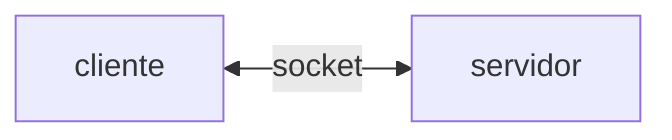
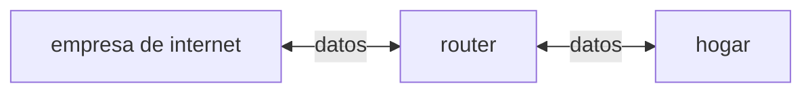
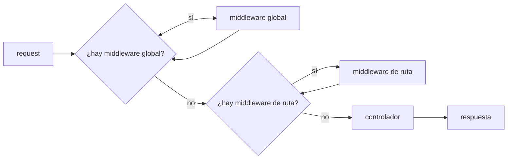

## Índice de Contenidos
0. [Introducción. ¿Por qué Encore?](#introducción-por-qué-encore)
1. [Primera etapa. Entendiendo el módulo `http`: servidores, solicitudes y respuestas](#primera-etapa-entendiendo-el-módulo-http-servidores-solicitudes-y-respuestas)
    - [Sobre `createServer`](#sobre-createserver)
    - [Observando una *request*](#observando-una-request)
    - [Observando una *response*](#observando-una-response)
    - [Analizando encabezados de una solicitud y de una respuesta](#analizando-encabezados-de-una-solicitud-y-de-una-respuesta)
2. [Segunda etapa. Creando nuestra clase principal](#segunda-etapa-creando-nuestra-clase-principal)
3. [Tercera etapa. Implementando un enrutador simple](#tercera-etapa-implementando-un-enrutador-simple)
    - [Definiendo *endpoints*](#definiendo-endpoints)
    - [Definiendo *handlers*](#definiendo-handlers)
    - [Sobre el *Single Responsibility Principle* y una hipotética Encore 2.0](#sobre-el-single-responsibility-principle-y-una-hipotética-encore-20)
4. [Cuarta etapa. *Middlewares*](#cuarta-etapa-middlewares)
    - [Implementando `registrarMiddleware()`](#implementando-registrarmiddleware)
    - [Implementando `ejecutarMiddleware()`](#implementando-ejecutarmiddleware)
    - [Primera prueba de integración](#primera-prueba-de-integración)
    - [*Middlewares* de ruta](#middlewares-de-ruta)
        - [Modificando `registrarRuta()` y `verificarRuta()`](#modificando-registrarruta-y-verificarruta)
        - [Nueva función: `ejecutarMiddlewareDeRuta(`)](#nueva-función-ejecutarmiddlewarederuta)
        - [Integrando todo: cómo queda `levantarServidor()`](#integrando-todo-cómo-queda-levantarservidor)
5. [Quinta etapa. Leyendo el *body* de una *request*](#quinta-etapa-leyendo-el-body-de-una-request)
    - [¿Cómo llega el *body* a nuestro servidor?](#cómo-llega-el-body-a-nuestro-servidor)
    - [Parseando el body de una request](#parseando-el-body-de-una-request)
    - [Agregando una tarea con POST](#agregando-una-tarea-con-post)
6. [Sexta etapa. Rutas dinámicas y más métodos HTTP](#sexta-etapa-rutas-dinámicas-y-más-métodos-http)
    - [Rutas dinámicas](#rutas-dinámicas)
        - [*Pattern matching* en `verificarRuta()`](#pattern-matching-en-verificarruta)
        - [Nuevo controlador: `traerUsuario()`](#nuevo-controlador-traerusuario)
    - [Más métodos HTTP: PUT y DELETE](#más-métodos-http-put-y-delete)
        - [Editando un registro con PUT](#editando-un-registro-con-put)
        - [Eliminando un registro con DELETE](#eliminando-un-registro-con-delete)
    - [Middleware global de manejo de errores](#middleware-global-de-manejo-de-errores)
7. [Séptima etapa. Publicando Encore en npm](#séptima-etapa-publicando-encore-en-npm)

## Introducción. ¿Por qué Encore?
El camino más sencillo para desarrollar servidores con JavaScript es recurrir a frameworks como Express.js o Nest.js. ¿Podríamos desarrollar backend con el módulo nativo de Node.js? Sí, claro, pero una librería como Express tiene muchas otras funcionalidades y además nos ahorran trabajo. La utilidad de una librería recae en que *abstrae* muchos procesos que, si decidiéramos no usar ninguna, deberíamos realizar nosotros como desarrolladores cada vez que escribimos código backend. 

Ahora bien, imaginemos que utilizamos Express: ¿qué pasa en el "detrás de escena" cuando escribimos algo como esto?

```javascript
import express from "express"

const app = express()
```

Para entender qué está pasando acá, *desarrollar un pequeño framework*, es decir, desarrollar algo como Express, es una muy buena opción. Se trata de un ejercicio interesante porque nos obliga a pensar funcionalidades que en módulos como Express o Nest ya están perfectamente implementadas. No se trata de "reiventar la rueda", sino de entender en qué consisten específicamente esas abstracciones que Express o cualquier framework backend ya maneja. Desarrollando un framework, entenderemos mucho mejor los conceptos de ruta, solicitud, respuesta, controlador, middlewares, procesos recursivos, etc. 

Esta idea es comparable, un poco, a la diferencia entre saber **manejar** y saber **cómo funciona un auto**. Por supuesto que, en la mayoría de los casos, entender cómo manejar es suficiente. Pero si queremos ir más allá, nos esperan otros desafíos: podemos saber cómo hacer un cambio (análogamente, podemos saber cómo levantar un servidor en Express), pero entender *cómo funciona* la maquinaria para que el cambio se produzca efectivamente (por ejemplo, cómo se mapean las rutas, siguiendo nuestra analogía) nos aporta un tipo de conocimiento diferente y muy valioso. Por supuesto, si vamos "para atrás" en los niveles de abstracción, podríamos preguntarnos cómo funciona el módulo `http`, cómo funciona Node, cómo está desarrollado el propio JavaScript... Esos niveles de abstracción son fascinantes pero escapan al objetivo de este proyecto. 

Esta documentación toma una decisión pedagógica importante que vale la pena aclarar. A lo largo de este recorrido, iremos haciendo dos cosas en simultáneo: por un lado, describiremos cómo se desarrolla un framework minimalista y los conceptos téoricos que existen detrás de ello y, por el otro, utilizaremos ese mismo framework para crear un servidor sencillo. La razón detrás de esta decisión es que, de esta manera, podemos ver los *efectos* de lo que construimos al mismo tiempo que lo desarrollamos. Podemos pensar, en términos téoricos, para qué necesitamos un enrutador, por ejemplo, y desarrollarlo, pero ver ese enrutador *en funcionamiento* hecha luz sobre nuestro trabajo, y nos permite entender de manera práctica para qué lo necesitamos y cómo funciona. 

Al finalizar la documentación, el lector estará entonces capacitado para también dos cosas: desarrollar su propio framework y también utilizarlo y crear sus propias aplicaciones backend; y, por qué no, luego enlazarlas con un frontend y construir una aplicación web completa. 

>Importante: Encore no está propuesto como un *reemplazo* de Express ni mucho menos. En esencia es solamente un ejercicio (funcional, sí) para aprender sobre el funcionamiento de los servidores. Como tal, **no es perfecto ni la mejor solución posible** a los problemas a resolver cuando se intenta desarrollar un framework. Está en mis planes seguir mejorando Encore para hacerlo cada vez más funcional, más prolijo y que su código sea más limpio y eficiente. 

## Primera etapa. Entendiendo el módulo `http`: servidores, solicitudes y respuestas
En este proyecto usaremos como base el módulo nativo de Node `http`. Con él, podremos acceder a funciones como `createServer` para crear el servidor o `listen` para poner nuestro servidor a escuchar en un puerto. Las primeras pruebas que haremos tendrán el objetivo de entender cómo funciona el módulo; probaremos algunas operaciones sencillas para recibir solicitudes, enviar respuestas, definir status codes, etc. 

### Sobre `createServer`
Veamos este ejemplo de código:
```javascript
import http from "http"

const puerto = 3000

const servidor = http.createServer((req, res) => {
    res.writeHead(200)
    res.end("Hola, mundo.")
})

servidor.listen(puerto, () => {console.log(`Servidor corriendo en ${puerto}.`)})
```
Este es un servidor muy simple que envía un status code de 200 (OK) y un mensaje genérico a cualquier *request*. El paso a paso, entonces, es:

1️⃣ Importar el módulo.  
2️⃣ Definir un puerto (habitualmente, en desarrollo, se usa el puerto 3000). Otra opción es definir el puerto en un archivo `.env` y luego traerlo con `dotenv`.  
3️⃣ Crear el servidor con la función que nos provee `http`.   
4️⃣ Poner el servidor a escuchar *requests* en el puerto seleccionado.   

La función `createServer` toma como parámetro una función *callback* que a su vez usar `req` y `res` como parámetros. Esta función se ejecuta *cada vez que nuestro servidor recibe una solicitud*. Esto es fundamental porque el objeto `req` nos permite acceder a datos importantes sobre las *requests* (como la URL o el método HTTP), como así también el objeto `res` nos permite leer información sobre la respuesta que va a dar el servidor. Veremos estos conceptos en los próximos apartados. 

💬 Para seguir pensando: ¿cómo se implementa esa "llegada" de una solicitud al servidor? Es decir, ¿cómo reconoce nuestro servidor que está llegando una *request*, y que debe responder con lo que escribimos en el cuerpo de la función *callback*? Eso nos lleva directamente al corazón de la implementación de Node, y de todo JavaScript: el concepto de *evento*. En términos simples: una solicitud se agrega a una *cola de eventos* cuando llega al servidor. En ese momento, Node recibe un aviso y ejecuta el *callback*. 

### Observando una *request*
Dentro de la función `createServer`, podemos escribir algo como esto:
```javascript
...
console.log(req.method) // GET
console.log(req.url) // /
...
```
Cuando accedemos a `localhost:3000` en el navegador, vemos que en la terminal obtenemos los dos resultados que están comentados en el ejemplo de código. Son dos resultados por defecto, dado que no tenemos otras rutas definidas en nuestro servidor. Luego, cuando definamos esas rutas y sus métodos, obtendremos otros resultados (verbos como POST, PUT o DELETE y rutas como `/usuarios`, por ejemplo, o `/api`. Eso dependerá de las rutas que definamos para nuestro servidor). 

Tanto `method` como `url` son propiedades del objeto `req` que podemos rastrear, incluso, si hacemos un `console.log(req)`. Allí, entre muchos otros datos, veremos que `method` y `url` son dos clave dentro del objeto `req`. Es interesante ver que otras propiedades, como `headers`, a la que también accedemos con `req.headers`, no son claves "simples" como `method` y `url`. En cambio, Node las implemente a partir de un símbolo, un tipo de dato especial para crear identificadores únicos. En el objeto `req`, veremos algo como `Symbol[kHeaders]`, que Node mapea con la propiedad `req.headers` y nos permite ver los encabezados de la *request*. 

### Observando una *response*
Similar a las operaciones que estuvimos analizando a propósito de una solicitud, también podemos observar algunas propiedades de las respuestas que da nuestro servidor. Veamos este ejemplo, retomando nuestra definición del servidor:
```javascript
...
res.writeHead(200)
res.end("Hola, mundo.")
...
```
Como ya dijimos, nuestro servidor ejecuta una función *callback* cada vez que recibe una solicitud. Esa función *callback*, como vemos en el ejemplo anterior, toma el objeto `res` (es decir, la respuesta) y hace dos cosas:

1️⃣ Envía un status code.  
2️⃣ Envía un string y cierra la respuesta.

Los status code son fundamentales porque "hablan" por nosostros. Forman parte de un código compartido entre programadores, dado que sabemos que un 200 representa una solicitud exitosa, mientras que un 404 nos dice que la ruta no fue encontrada (el famoso Not Found Error 404). Por ejemplo, si nuestra aplicación backend quiere comunicar al equipo de frontend que se creó un recurso nuevo existosamente, podría enviar, en el cuerpo de la respuesta, un status code 201. Así, no tendría que enviar ningún mensaje escrito, por ejemplo algo como "Usuario registrado correctamente"; la comunicación entre equipos se torna así más limpia, dado que parte de códigos compartidos por los desarrolladores. 

El método `res.end` envía el *body* de la respuesta. En este caso, simplemente enviamos un string en pantalla. `res.end` solo puede llamarse una vez; si quisiéramos escribir más mensajes, tendríamos que usar el método `res.write`, que sí puede ser llamado cuantas veces querramos. 

### Analizando encabezados de una solicitud y de una respuesta
Para acceder a los encabezados de una **respuesta** tenemos dos opciones:

1️⃣ Podemos usar un cliente como Thunder Client o Postman y acceder a los encabezados en la pestaña Headers del apartado de la respuesta.   
2️⃣ También podemos usar el navegador. En este caso, es necesario recurrir a las DevTools. Vamos al apartado Network --> click en *request* --> *response* Headers. 

Esto es interesante porque nos permite rastrear cómo Node maneja los encabezados de una respuesta en contraste con los de una solicitud. Nosotros como desarrolladores no podemos acceder a los *headers* directamente con un `console.log(res.headers)`, como sí podemos hacer un `console.log(req.headers)`. ¿Por qué se produce esa asimetría? Básicamente, porque Node entiende que los encabezados de una *solicitud* constituyen información que el servidor consume, y que son fundamentales para manejarla correctamente, pero no considera lo mismo de los encabezados de una *respuesta*. 

Por ejemplo, algunos *headers* típicos que vienen en una *request*:

- **Content-Type** --> este encabezado le dice al servidor qué tipo de contenido tendrá la solicitud. Por ejemplo, en aplicaciones backend, lo más normal es un valor de `application/json`, que nos dice que la información vendrá en formato JSON, y le permite al cliente parsear esa información en ese formato.
- **Authorization** --> este *header* es central porque permite rechazar o aceptar solicitudes en términos de autorización. Típicamente, algunas rutas de un servidor requieren que el usuario inicie sesión, además de verificar que el usuario esté en la base de datos y que las credenciales sean correctas. Por ejemplo, en un backend de una aplicación que permite registrar tareas, una ruta restringida por seguridad podría ser la de perfil (para ingresar a tu perfil necesitás iniciar sesión; de lo contrario, cualquiera podría acceder a tu perfil solo ingresando la URL correcta). Esto, en términos de Node, se logra generalmente implementando un token que se envía en la respuesta a esa solicitud de inicio de sesión y luego se envía, desde el cliente, en cada *request*. El servidor verifica ese token y permite seguir operando.

Si nuestra *request* es GET, típicamente no tiene *body* (solo "pide" datos). En cambio, métodos como POST (para guardar un recurso en una base de datos), PUT (para reemplazar un recurso completo), PATCH (para reemplazar solo algunos campos del recurso) o DELETE (para eliminar un recurso) sí necesitan un cuerpo de solicitud porque requieren datos para realizar la operación (por ejemplo, la nueva información para crear un recurso o el ID de un recurso para eliminarlo).

De esta forma, los encabezados de una *respuesta* representan información que el servidor *envía*, y que en todo caso será importante para, por ejemplo, un frontend (como es el caso del token de seguridad), pero no tanto ya para el servidor. Ahora bien, ¿por qué los encabezados de una respuesta ya no están disponibles para el servidor? Es decir, ¿por qué no podemos verlos con un `console.log(res.headers)`? Básicamente, porque el servidor los "olvida" ni bien los envía. Veamos este pequeño gráfico:


El *socket* es el espacio bidireccional por donde "viajan" las solicitudes y las respuestas. Dado que el servidor los escribe *directamente* en el socket, los encabezados de la respuesta ya no están disponibles para nosotros del lado del servidor: por eso no podemos leerlos con un `console.log(res.headers)` y debemos usar un cliente externo, como Postman o el propio navegador en conjunto con las DevTools. 

En resumen, entonces:

- *Headers* de una **solicitud** --> podemos verlos con un `console.log(req.headers)`.  
- *Headers* de una **respuesta** --> no disponibles con `console.log()`. Los vemos con un cliente externo. 

## Segunda etapa. Creando nuestra clase principal
Retomemos nuestro primer ejemplo:
```javascript
import express from "express"

const app = express()
```
¿Qué es exactamente `app`? Una instancia de un objeto. De esta manera, para crear nuestro framework, nosotros deberíamos desarrollar una *clase* que represente nuestra aplicación backend. Para eso, vamos en primer lugar a armar algo simple:
```javascript
class App {
    constructor() {
        this.rutas = {}
    }
}
```
Desglosemos el código:

1️⃣ Primero definimos una clase `App` que representa nuestra aplicación, a la que luego le agregaremos métodos específicos para definir su comportamiento.   
2️⃣ Utilizamos una función constructora para definir un objeto vacío. Notemos la importancia del `this`: `this` permite que, cuando instanciemos la clase, los métodos estén disponibles para ese nuevo objeto. Si solo usáramos una variable local, no podríamos luego trabajar libremente con esa instancia de la clase `App`. Así, cuando luego instanciemos la clase, crearemos un objeto vacío `rutas`.   
3️⃣ ¿Para qué un objeto vacío? La idea es que, en ese objeto vacío, nuestro servidor almacene las rutas que vamos a predefinir para nuestra aplicación.   

Para levantar nuestro servidor, vamos a incorporar entonces la función `createServer()`; ahora ya no en nuestro archivo principal `index.js` sino en la clase `App`. De esta manera, nuestra clase `App` ahora tiene un poco más de cuerpo:
```javascript
const puerto = 3000

class App {
    constructor() {
        this.rutas = {}
    }

    levantarServidor() {
        const servidor = http.createServer((req, res) => {
            res.end("Hola, mundo.")
        })
        
        servidor.listen(puerto, () => {console.log(`Servidor corriendo en ${puerto}.`)})
    }
}
```
Veremos que el resultado es el mismo que cuando definimos el servidor en nuestro `index.js`. Ahora, sin embargo, el funcionamiento de la aplicación empieza a acercarse a cómo funciona un framework. Así como en Express hacíamos esto:
```javascript
import express from "express"

const app = express()
app.listen(3000, () = > {console.log("Servidor corriendo en 3000.")})
```
ahora en nuestro propio framework haremos algo como:
```javascript
import http from "http"
import { App } from "./class.js"

const app = new App()
app.levantarServidor()
```
El paso a paso, vemos, es similar. Creamos una instancia del objeto `App` y llamamos al método que levanta el servidor. 

## Tercera etapa. Implementando un enrutador simple
Terminada la segunda etapa, nuestro servidor está corriendo. Ahora, para que se acerque todavía más a lo que implica un framework backend, necesitamos implementar lo que podríamos llamar un *enrutador*. Básicamente, y en términos estrictos, un enrutador es un dispositivo que dirige datos de una red a otra. Estos dispositivos son muy comunes para conectarse a internet, por ejemplo, porque permiten interconectar la red de la empresa que provee el servicio a la red de los hogares que contratan ese servicio (por eso en todos esos hogares hay un *router*). Tendríamos algo así:

Si implementáramos un enrutador en nuestro proyecto, se encargaría dar el primer paso en el manejo de las solicitudes. Así como el enrutador de internet trae datos de la empresa y los envía al hogar, y viceversa, el enrutador de nuestro servidor recibe datos (la solicitud a un endpoint) y los envía (al *handler* correspondiente). El flujo sería así: un cliente envía una solicitud a un endpoint y, si ese endpoint está registrado en nuestro servidor, el enrutador se encargaría de llamar a la función que maneja ese endpoint. Luego esa función (que llamamos anteriormente *handler*, o también puede ser encontrada como *controlador*) envía una respuesta al cliente. Si el endpoint no está registrado, se envía un error 404. 

En este momento, nuestro servidor solo responde "Hola, mundo." a cualquier solicitud. ¿Tiene sentido que, si yo hiciera una solicitud a un endpoint para, por ejemplo, traer todos los usuarios registrados en mi aplicación, el servidor me responda con ese mensaje? Evidentemente, no. Entonces, para que nuestro servidor responda de manera funciona, necesitamos dos cosas: 

1️⃣ Definir los endpoints (con su método y ruta asociados).  
2️⃣ Definir las funciones que se ejecutan cuando se hace una solicitud a esos endpoints.   

Ahora bien, ¿cómo desarrollamos esto? Ya tenemos cubierta una parte: el objeto vacío que definimos con la función constructora funciona como almacén de rutas; es ahí donde vamos a ir almacenando las rutas predefinidas para nuestro servidor. Definir una ruta, en realidad, consta de dos pasos: definirla y *guardarla*, para que luego nuestro enrutador verifique que la ruta solicitada *es* un endpoint válido del servidor. 

### Definiendo endpoints
Como mencionamos en la introducción de esta documentación, vamos a hacer dos trabajos en simultáneo: vamos a **desarrollar** un framework y además **utilizarlo** para crear un servidor. Es importante hacer esta distinción porque en términos estrictos, definir endpoints no forma parte del desarrollo *del framework*; en todo caso, es parte de lo que ese framework nos *permite hacer*, es decir, parte del trabajo de desarrollar un servidor. Es la distinción entre funcionamiento y uso. 

Pensémoslo así: Express no "viene" con endpoints predefinidos, justamente porque un framework constituye el marco de trabajo para que nosotros los desarrolladores *construyamos* ese servidor *a partir* de ese marco de trabajo. El framework nos provee de las *condiciones de posibilidad* de todas las funcionalidades de un servidor, y nosotros lo utilizamos para construirlo. Hecha esta salvedad más bien técnica, vamos a empezar a definir endpoints en nuestro servidor. 

Definir una ruta implica establecer una asociación entre una URL, un método HTTP y una función *handler*. Por ejemplo, imaginemos que estamos utilizando Encore para crear una aplicación que registra tareas. Podemos tener una ruta GET `/tareas` que traiga todas las tareas registradas en nuestra aplicación; pero también podemos tener una ruta POST `/tareas` que cree una tarea nueva. En este ejemplo, el endpoint es el mismo, lo que cambia es el método HTTP. 

Volvamos a nuestra clase `App`. Ya definimos un objeto vacío `rutas` para almacenar las rutas y un método que levanta el servidor. Ahora vamos a definir un método que registre nuestra rutas. Como dijimos anteriormente, una ruta consta de una URL, un método y una función que maneje esa ruta (en este momento de nuestra aplicación, la única función que maneja rutas es el *callback* del método para levantar el servidor, que ya vamos a modificar). Así, tenemos que definir una función que *guarde* todos esos datos en el objeto vacío; de esta manera tenemos algo sobre lo que una posterior función verificadora efectivemente trabaje para manejar las solicitudes. 

Veamos este ejemplo:
```javascript
registrarRuta(ruta, handler, metodo) {
    if (!this.rutas[metodo]) {
        this.rutas[metodo] = {}
    }

    this.rutas[metodo][ruta] = handler
    }
```
Esta función define tres parámetros: `ruta`, `handler` y `metodo`. Básicamente, son los tres datos con los que vamos a registrar el endpoint en nuestro objeto de rutas. Los tres datos son fundamentales porque, como ya mencionamos en otra oportunidad, podemos tener en nuestro servidor dos rutas "iguales" (misma URL, por ejemplo `/tareas`) pero con diferente método HTTP (por ejemplo, GET y POST). Así, en nuestro objeto `rutas` los dos endpoints serán dos datos diferentes. 

> Importante: por el momento no vamos a definir los handlers específicamente. Por ahora, solo es importante saber que el servidor ejecutará una función correspondiente a cada ruta, por eso es necesario guardar ese dato. En el próximo apartado nos ocuparemos de ello. 

El cuerpo de la función define una condición que es la que efectivamente *guarda* la ruta en el objeto `rutas`. Veamos el paso a paso. 

1️⃣ Filtra primero por método, dado que intenta buscar en el objeto algo como  
```javascript
{ 
    "GET": {}
}
```
2️⃣ Si no encuentra el método, lo crea.   
3️⃣ Luego guarda la ruta. Así, el objeto quedaría de la siguiente manera:  
```javascript
{
    "GET": 
    {
        "/tareas": traerTareas
    }
}
```
La idea del paso 1 es que, si luego hay que registrar otra ruta con el método GET, no se guarda un nuevo objeto repitiendo el GET, sino que se guarda dentro de ese objeto, así:
```javascript
{
    "GET": 
    {
        "/tareas": traerTareas
    }, 
    {
        "/usuarios": traerUsuarios
    }
}
```
De esta manera, vamos organizando las funciones a partir de su método HTTP. Recordemos que, al guardar las rutas, no guardamos la función en sí, sino una *referencia* a ella (la diferencia está en los paréntesis).

Definimos la función para registrar las rutas, pero ¿cómo las *registramos*, efectivamente? Es decir, ¿en qué momento *llamamos* a esa función? En este punto del desarrollo vamos a agregar algunas líneas de código a nuestro archivo *entry point*, es decir, nuestro `index.js`:

```javascript
...
app.registrarRuta("/", inicio, "GET")
app.registrarRuta("/tareas", traerTareas, "GET")
app.registrarRuta("/usuarios", traerUsuarios, "GET")
...
```

Luego de las importaciones necesarias y de crear nuestra objeto `app`, instancia de la clase `App`, ahora vamos a recurrir al método `registrarRuta` para registrar tres rutas. Siguiendo el ejemplo de una aplicación para registrar tareas, tendremos: 

1️⃣ GET `/` --> ruta por defecto de nuestro servidor. Solo mostrará un mensaje de bienvenida.   
2️⃣ GET `/tareas` --> ruta que lista todas las tareas registradas por un usuario.   
3️⃣ GET `/usuarios` --> ruta que lista todos los usuarios registrados en la aplicación.   

> Dado que todavía no implementamos la lectura del *body* de una solicitud ni el soporte para parámetros de ruta, todavía no podemos registrar rutas de tipo POST, PUT o DELETE. 

De esta manera definimos las rutas que nuestro servidor aceptará, por el momento, y a las que se podrán hacer solicitudes desde un cliente externo. Ahora bien, ¿cómo hace el servidor para responder? Es decir, ¿cómo se ejecuta, efectivamente, la función que corresponde a cada ruta? Eso lo veremos en el próximo apartado. 

### Definiendo *handlers*
En el apartado anterior pusimos como ejemplo tres funciones: `inicio`, `traerUsuarios`, `traerTareas`. Estas tres funciones son las que van a responder cuando nuestro servidor reciba solicitudes a alguno de estos tres endpoints que ya definimos en nuestro objeto `rutas` dentro de la clase `App`. 

Ahora bien, también es necesario verificar, de alguna manera, que las rutas que están recibiendo solicitudes efectivamente *existen* en nuestro objeto de rutas. ¿Cómo hacemos eso? Implementando lo que vamos a llamar una *función verificadora*. 

Dentro de `App`, vamos a definir este método:
```javascript
verificarRuta(ruta, metodo) {
    if (!this.rutas[metodo]) {
        return false
    } else {
        return this.rutas[metodo][ruta]
    }
}
```
¿Cómo funciona? Básicamente, este es un método sencillo que recibe dos parámetros, la ruta y el método de la solicitud (ya veremos luego cómo hacemos para acceder a esos datos). Establecemos una condición: intentamos buscar esos datos dentro de nuestro objeto `rutas` y, si lo encontramos, devolvemos el *handler* asociado a la ruta. Si no lo encontramos, significa que la ruta solicitada no existe, entonces devolvemos `false`.

Ahora: ¿dónde llamamos a esta función? En algún lugar en donde tengamos acceso a los objetos `req` y `res`, para poder acceder a `req.method` y `req.url` y pasarlos como argumentos. ¿Cuál es ese lugar? En nuestro método `levantarServidor`. Veamos cómo queda la función completa, con el agregado de la verificación de la ruta: 
```javascript
levantarServidor() {
    const servidor = http.createServer((req, res) => {
        const handler = this.verificarRuta(req.url, req.method)
        if (handler) {
            res.writeHead(200)
            handler(req, res)
        } else {
            res.writeHead(404)
            res.end("Ruta no encontrada.")
        }
    })
    
    servidor.listen(puerto, () => {console.log(`Servidor corriendo en ${puerto}.`)})
}
```
Repasemos el código.

1️⃣ El servidor está definido con `createServer`.    
2️⃣ Ahora, el agregado es el siguiente: llamamos a la función `verificarRuta` y le pasamos dos argumentos, `req.url` y `req.method` que son, como sus nombres lo indican, las dos propiedades de la solicitud que necesita la función verificadora.   
3️⃣ Si la función verificadora encontró en el objeto de rutas un objeto que combine la ruta y el método que le pasamos, devuelve la función asociada a esa combinación de ruta y método. En ese caso, enviamos un código de status 200 y llamamos a ese *handler*.   
4️⃣ Si no lo encuentra, devuelve un error 404.   

🧠 ¿Por qué estamos pasando el objeto `req` ahora, si no parece ser necesario? Nuestro servidor, por el momento, no acepta rutas dinámicas ni lee el *body* de las *requests*, pero más adelante lo hará, y en esos casos necesitaremos sí o sí el objeto `req`; es mejor pasarlo desde el inicio y luego usarlo sin problemas, que tener que modificar el código luego. 

Si bien nuestro servidor avanzó considerablemente, todavía no funciona bien. ¿Por qué? Porque todavía no definimos esas cuatro funciones que mencionamos anteriormente. Vamos paso a paso. 

1️⃣ En primer lugar, vamos a crear una pequeña base de datos MySQL para guardar la información que vayamos cargando en nuestra aplicación. Para eso, vamos a abrir un archivo `schema.sql` para cargar el código SQL que luego insertaremos en terminal:
```sql
CREATE DATABASE app_tareas;
USE app_tareas;

CREATE TABLE usuarios
(id integer PRIMARY KEY AUTO_INCREMENT,
nombre varchar(255) NOT NULL,
email varchar(255) NOT NULL);

CREATE TABLE tareas
(id integer PRIMARY KEY AUTO_INCREMENT,
nombre VARCHAR(255) NOT NULL,
categoria VARCHAR(255) NOT NULL,
id_usuario INTEGER NOT NULL,

FOREIGN KEY (id_usuario) REFERENCES usuarios(id));

INSERT INTO usuarios (nombre, email) VALUES
('pedro', 'pedro@mail.com'),
('galapha', 'galapha@email.com');

INSERT INTO tareas (nombre, categoria, id_usuario) VALUES 
('terminar monografía', 'urgente', 1), 
('arreglar calefón', 'puede esperar', 2);
```

Con este código, crearemos la base de datos app_tareas y agregaremos dos tablas: una para usuarios y una para tareas.

>Para poder correr este código en terminal, hay que tener instalado el cliente de MySQL. Es fundamental, también, tenerlo instalado como Servicio (por lo menos en Windows) dado que, de lo contrario, no podremos conectarnos.

Para confirmar que la base de datos se haya creado correctamente, podemos correr el comando `show databases;`, de manera que, si todo salió bien, obtendremos este resultado en terminal:
```bash
mysql> show databases;
+--------------------+
| Database           |
+--------------------+
| app_tareas         |
| information_schema |
| mysql              |
| performance_schema |
| sys                |
+--------------------+
```
También podemos correr algunos comandos de prueba sencillos para familiarizarnos con el cliente. Por ejemplo, para mostrar todas las tareas cargadas, podemos escribir esto:
```bash
mysql> select * from tareas;
+----+---------------------+---------------+------------+
| id | nombre              | categoria     | id_usuario |
+----+---------------------+---------------+------------+
|  1 | terminar monografía | urgente       |          1 |
|  2 | arreglar calefón    | puede esperar |          2 |
+----+---------------------+---------------+------------+
```

2️⃣ Ahora nos tocaría escribir los handlers que interactúen con esos datos. Por ejemplo, la función `traerTareas()` debería justamente ejecutar el SQL que mencionamos justo en el paso anterior (`SELECT * FROM tareas`). Ahora bien, para que nuestras funciones puedan correr ese código, necesitamos crear un objeto de conexión que pueda ser importado en el archivo `handlers.js`, y que cada función ejecute la sentencia SQL que corresponda, si aplica. 

>Nota. En una implementación más robusta de un servidor, en realidad es la capa de **modelos** la que se encarga de interactuar con las bases de datos. Sin embargo, para este servidor de prueba, sencillo, que solamente busca mostrar el framework en acción, creo suficiente correr el SQL directamente en el controlador. 

Vamos a crear un archivo `data.js` y vamos escribir este código:
```javascript
import mysql from "mysql2"
import "dotenv/config"

const conexion = mysql.createPool({
    host: process.env.HOST,
    user: process.env.USER,
    password: process.env.PASSWORD,
    database: process.env.DATABASE,
}).promise()

export { conexion }
```
Primero tenemos que instalar (si no los tenemos instalados aún) los módulos mysql2 y dotenv. Utilizaremos el primero para interactuar con el cliente MySQL y el segundo para traer la información sensible de un archivo .env. Cada persona que quiera correr este código deberá tener un archivo .env en su máquina, de manera que dotenv pueda importar de ahí los datos necesarios. 

> Habitualmente, para proyectos locales, podemos usar el user root y una password vacía. Eso lo configuramos cuando entramos a MySQL desde la terminal, con algo como
```bash
mysql -u root -p
Enter password: // acá apretamos Enter
```
El objeto `conexion` está ahora disponible para importar en nuestro archivo de funciones controladoras, que vamos a escribir en este momento.  
```javascript
import { conexion } from "./data.js"

function inicio(req, res) {
    res.end(JSON.stringify({mensaje: "Bienvenidos a mi servidor creado con Encore."}), null, 2)
}

async function traerUsuarios(req, res) {
    res.writeHead(200, {
        "Content-type": "application/json"
    })

    const consulta = "SELECT * FROM usuarios"
    const resultado = await conexion.execute(consulta)
    res.end(JSON.stringify(resultado[0], null, 2))
}

async function traerTareas(req, res) {
    res.writeHead(200, {
        "Content-type": "application/json"
    })

    const consulta = "SELECT * FROM tareas"
    const resultado = await conexion.execute(consulta)

    res.end(JSON.stringify(resultado[0], null, 2))
}

export { inicio, traerUsuarios, traerTareas }
```

Notemos la importancia de utilizar `async/await`. Como nuestro objeto conexion nos devuelve una promesa, es necesario utilizar `await` para "esperar" que llegue el resultado de la consulta. Si no "esperamos" el resultado, obtendremos un `undefined` y no podremos mostrar la información requerida. La única que no es una función asincrónica es la función `inicio()`, porque no consulta a la base de datos (solo muestra un mensaje de bienvenida estático).

La implementación es muy sencilla, pero nos permite tener nuestro servidor andando y que cada ruta "haga algo diferente", no que envíen solo un "Hola, mundo." como hacían anteriormente. Cada función tiene una tarea: `traerUsuarios` devuelve los usuarios en la base de datos, `traerTareas` las tareas e `inicio` manda un mensaje de bienvenida. Notemos que no podemos simplemente hacer un `res.end(resultado[0])`, dado que `res.end()`admite típicamente strings (o buffers), y lo que estamos devolviendo es un arreglo. Para eso usaremos la función nativa de JavaScript que nos permite convertir un objeto a un string con formato JSON. La función `JSON.stringify()` acepta tres parámetros: el objeto a convertir, un *replacer*, que altera el comportamiento del proceso de conversión (que aquí definimos como `null` porque no es relevante en este contexto) y un número o string que representa la indentación que queremos darle a la cadena final. 

También es importante notar que, en estas funciones, definimos un *header* `Content-type`. ¿Por qué es importante esto? Porque, en realidad, nosotros desde el servidor no enviamos JSON "puro", sino que enviamos algo parecido que el cliente puede *interpretar* como JSON. Cuando el cliente lee el *header* de `Content-type`, puede parsear el contenido de la respuesta con algo como `JSON.parse()` e interpretar los datos en ese formato. Cuando en Express hacemos algo como
```javascript
res.json(usuarios)
```
la idea es la misma: Express setea el *header* a `Content-type: application/json` y procesa la información con `JSON.stringify()` para que el cliente que recibe la solicitud pueda parsear esa información como JSON. La única diferencia es que acá lo estamos haciendo manualmente, lo que nos ayuda a entender el proceso interno. 

### Sobre el *Single Responsibility Principle* y una hipotética Encore 2.0. 
El principio de responsabilidad única sostiene que una clase solo debería tener una tarea. Por ejemplo, podríamos pensar que nuestra clase App, el núcleo de la aplicación, solo debería levantar el servidor y escuchar. Del proceso de enrutamiento, es decir, el que llevan a cabo las funciones registrarRuta y verificarRuta, podría encargarse *otra* clase, distinta a la clase App. Esto es exactamente como lo implementa Express. Veamos este ejemplo:
```javascript
const rutaProductos = express.Router()

rutaProductos.get("/productos", controladores.traerProductos)
rutaProductos.get("/producto/:id", controladores.traerProductoID)
rutaProductos.post("/producto/crear", controladores.crearProducto)
rutaProductos.delete("/producto/:id", controladores.eliminarProducto)

export default rutaProductos
```
En el código propuesto, la variable `rutaProductos` es una instancia del objeto `Router`. Por lo que vemos en las líneas siguientes, es decir, la definición de las rutas, el objeto Router debe contener en su definición un método para cada verbo HTTP (en Encore, registrarRuta es una función "general" porque registra todas las rutas sin hacer distinción por método HTTP). Y luego, en el index.js, hacemos algo así:
```javascript
app.use("/productos", rutaProductos)
```
Básicamente, la idea es que con el método `use`, definido en la clase Express, podríamos registrar esas rutas, dado que le estamos pasando el objeto `Router` que contiene esas rutas definidas antes.

Ahora bien, en Encore, tanto la responsabilidad de levantar el servidor como de enrutar recaen en la clase `App`. Esto no es problemático porque Encore se trata de un *framework* minimalista, pero sí es cierto que en futuras versiones sería algo a tener en cuenta para mejorar el trabajo y hacerlo más modular, un concepto fundamental en programación que hace mucho más mantenibles los programas y permite escalarlos mucho más fácilmente. ¿Cómo podríamos, entonces, implementar esto en una hipotética segunda versión de Encore?

1️⃣ Definiríamos una clase `Router`, algo así:  
```javascript
class Router {
    constructor() {
        this.rutas = {}
    }
}
```
2️⃣ Luego, definiríamos las rutas en un archivo separado al `index.js`, así:  
```javascript
const rutasUsuarios = new Router()

rutasUsuarios.registrarRuta("/usuarios", traerUsuarios)
rutasUsuarios.registrarRuta("/tareas", traerTareas)

export { rutasUsuarios }
```
La idea de la modularidad es que los métodos de enrutamiento estén definidas en el objeto `Router`, no en el objeto `App`. 

3️⃣ Ahora bien, ¿cómo hace nuestro servidor para verificar que las rutas existen, si en realidad estamos agregando las rutas registradas al objeto vacío de cada objeto Router? Tendríamos que implementar algo que *conecte* ambos objetos, el de cada grupo de rutas con el objeto de rutas general. Podríamos definir un método `use` en `App` (como hace Express) para pasar las rutas del objeto propio al objeto rutas de App, algo así:  
```javascript
app.use(rutaProductos)
```
4️⃣ Dentro de App, el método `use` usaría el método `Object.assign()` para combinar los dos objetos. Así, el servidor "busca" las rutas en el objeto rutas de `App`, que contiene ahora todas las rutas.   

> Nota sobre la arquitectura de la aplicación. En lo que venimos describiendo, App debería importar la función `registrarRuta`, dado que esta "vive" en Router, no en `App`. Podríamos pensar en que esto "rompería" el principio de modularidad, pero no es tan así si pensamos en la dirección en la que se produce la importación: `App`, clase más "general" del framework, importa de Router, y no al revés. No es que `verificarRuta` "vive" en `App`, sino que `App` la importa porque la necesita. 

En resumen:
- Clase `App` --> construye un objeto vacío "general" para todas las rutas de la aplicación y levanta el servidor. 
- Clase `Router` --> se encarga del enrutamiento (registra y verifica). `App` importa `verificarRuta` y la llama cada vez que llega una solicitud al servidor. 

## Cuarta etapa. *Middlewares*
Los *middlewares* son fundamentales para la estructura de un servidores porque permiten procesar información *antes* de que las solicitudes lleguen a su función controladora. Típicamente, un *middleware* es una función de JavaScript que tiene la siguiente firma:
```javascript
funcionMiddleware(req, res, next)
```
Un *middleware* hace su trabajo y luego llama a `next()` para seguir la cadena de ejecución, de manera que la solicitud pueda llegar a su función controladora. Los *middlewares* se ejecutan de manera secuencial, en orden; esto es importante, y veremos cómo ingluye en la manera de implementar el soporte para *middlewares* en nuestro *framework*. 

¿Qué vamos a necesitar para implementar esta funcionalidad?  

1️⃣ Una función que, análoga a `registrarRuta`, permita registrar *middlewares*.  
2️⃣ Una función que ejecute los *middlewares* en orden.   

### Implementando `registrarMiddleware()`
Como mencionábamos anteriorimente, necesitamos escribir una función que registre los *middlewares*, así como más adelante en nuestro recorrido implementamos una función que registra las rutas de nuestro servidor. El procedimiento es similar: en primer lugar, vamos a necesitar un "lugar" donde almacenar esos *middlewares*. Si para almacenar las rutas habíamos creado un objeto rutas, para almacenar los *middlewares* vamos a crear un *array* *middlewares*. ¿Por qué un arreglo? Porque los arreglos nos permiten trabajar con *índices*, de manera que la ejecución sencuencial de los *middlewares* va a ser mucho más sencilla. De esta manera, la función constructora queda ahora así:
```javascript
constructor() {
    this.rutas = {}
    this.middlewares = []
}
```
En segundo lugar, y para escribir la función que registra los *middlewares*, vamos a agregar esta porción de código a nuestra definción de la clase *App*:
```javascript
registrarMiddleware(funcion) {
    if (!this.middlewares.includes(funcion)) {
        this.middlewares.push(funcion)
    }
}
```
Esta función entonces toma como parámetro otra función (el *middleware*), verifica que no esté ya en la lista de *middlewares* registrados y, si no está, lo agrega. 

Esta función sería análoga a use() en Express. Si en Express hacíamos esto:
```javascript
app.use(middleware)
```
En Encore, nuestro `index.js` se ve ahora de la siguiente manera:
```javascript
const app = new App()

app.registrarRuta("/", handlers.inicio, "GET")
app.registrarRuta("/tareas", handlers.traerTareas, "GET")
app.registrarRuta("/usuarios", handlers.traerUsuarios, "GET")
app.registrarRuta("/tarea", handlers.nuevaTarea, "POST")

app.registrarMiddleware(middlewares.middlewareMetodo)

app.levantarServidor()
```
El *middleware* que aparece en la línea para registrar *middlewares* es el siguiente:
```javascript
function middlewareMetodo(req, res, next) {
    console.log(`Método ${req.method}, URL ${req.url}`)
    next()
}
```
Es una función sencilla que imprime en consola el método y la URL de la solicitud. Lo escribimos en un archivo aparte, `middlewares.js`, y lo importamos en el archivo principal. 

El orden en el que escribimos todas las llamadas a los métodos de la clase `App` es importante:

1️⃣ Primero definimos las rutas.  
2️⃣ Luego definimos los *middlewares*.  
3️⃣ Luego levantamos el servidor.  

Los pasos 1 y 2 pueden invertirse, pero sí o sí deben escribirse *antes* de levantar el servidor. La razón es que *dentro* de la función que levanta el servidor tendremos que verificar rutas y *middlewares*, de manera que debemos haberlos definido *antes* para poder hacer la verificación. 

### Implementando `ejecutarMiddleware()`
Ya tenemos rutas y *middlewares* definidos. Ahora, ¿cómo hacemos para que el servidor ejecute el/los *middleware*/s *antes* de ejecutar el controlador asociado a la ruta de la solicitud? Veamos cómo quedó implementado ahora nuestra función para levantar el servidor:
```javascript
levantarServidor() {
    const servidor = http.createServer((req, res) => {
        const ejecutarRuta = () => {
            const handler = this.verificarRuta(req.url, req.method)
            if (handler) {
                handler(req, res)
            } else {
                res.writeHead(404)
                res.end(JSON.stringify({mensaje: "Ruta no encontrada."}), null, 2)
            }
        }

        this.ejecutarMiddleware(req, res, 0, ejecutarRuta)
    })
    
    servidor.listen(puerto, () => {console.log(`Servidor corriendo en ${puerto}.`)})
}
```
Desglosemos el código:

1️⃣ Primero definimos (pero todavía no llamamos) una **función callback** que va a ejecutarse cada vez que llega una solicitud a nuestro servidor. Nombramos a esa función callback `ejecutarRuta` para hacerlo más claro. Dentro de esta función callback verificamos la ruta de la solicitud, ejecutamos el controlador y enviamos la respuesta correspondiente al cliente.   
2️⃣ En segundo lugar, llamamos a la función `ejecutarMiddleware()`, pasándole los objetos `req` y `res` como argumentos, además de un `0` (ya veremos por qué) y el propio callback que definimos primero.   
3️⃣ Veamos de cerca la función `ejecutarMiddleware()`:  
```javascript
ejecutarMiddleware(req, res, index, callback) {
    if (index === this.middlewares.length) {
        callback()
        return
    }

    const middlewareAEjecutar = this.middlewares[index]
    const next = () => {
        this.ejecutarMiddleware(req, res, index + 1, callback)
    }

    middlewareAEjecutar(req, res, next)
}
```
La función define cuatro parámetros: los objetos `req` y `res`, la variable `index` y un callback (luego le pasaremos `ejecutarRuta()`, el que definimos dentro de `levantarServidor()`). ¿Por qué es importante pasarle un índice? Porque, como necesitamos que los *middlewares* se ejecuten en orden, podemos acceder a ellos a través de su posición en el arreglo. 

Analicemos ahora esta parte:
```javascript
const middlewareAEjecutar = this.middlewares[index]
const next = () => {
    this.ejecutarMiddleware(req, res, index + 1, callback)
}
```
Básicamente, primero guardamos en una variable el *middleware* que vamos a ejecutar. Imaginemos que nuestro arreglo de *middlewares* es el siguiente:
```javascript
const middlewares = [middlewareMetodo]
```
Si a la función `ejecutarMiddleware()` le pasamos `0` como índice (para empezar ejecutando el primer *middleware* almacenado en nuestro *array*), la variable `middlewareAEjecutar` será `middlewareMetodo`. 

En la introducción de esta cuarta etapa, dijimos que un *middleware* es una función que primero ejecuta su código y luego le pasa el "control" a otra función; en términos de lo que estamos desarrollando ahora, "pasar el control" es básicamente ejecutar el siguiente *middleware* del arreglo. ¿Cómo logramos eso? Aumentando el valor de `index` en 1. Por eso la definición de la función flecha `next()` es, en última instancia, volver a llamar a `ejecutarMiddleware()` pero con `index + 1` como argumento. Es un proceso recursivo: definimos cuál es el siguiente *middleware* a ejecutar y llamamos a `ejecutarMiddleware()` con ese *middleware* pasado como argumento. 

De esta manera, entonces, repasemos todo el flujo de definición y ejecución:

1️⃣ Creamos un *array* `middlewares` para almacenar los *middlewares* que definamos.   
2️⃣ Creamos una función que guarda los *middlewares* en ese *array*.   
3️⃣ Definimos una función que ejecuta, recursivamente, los *middlewares* globales que guardamos en el arreglo.   
4️⃣ En la función que crea el servidor, llamamos a la función del punto 3 y ejecutamos los *middlewares* uno detrás del otro.   
5️⃣ Cuando se ejecutaron todos los *middlewares*, ejecutamos el controlador asociado a la ruta de la solicitud.   

### Primera prueba de integración
Con lo que desarrollamos hasta ahora, podemos realizar una prueba para ver cómo se comportan los *middlewares* y los controladores. Para ver mejor el funcionamiento del orden secuencial de los middlewares, vamos a registrar otro, así:
```javascript
function setearHeader(req, res, next) {
    res.setHeader("X-Powered-By", "Encore")
    console.log("Header seteado: 'X-Powered-By Encore'")
    next()
}
```
Y luego, en `index.js`:
```javascript
app.registrarMiddleware(middlewares.setearHeader)
```
Ahora vamos a hacer una solicitud utilizando, en este caso, el motor `curl`, dado que es una solicitud bien rápida. Escribimos este comando en terminal:
```bash
curl.exe -X GET http://localhost:3000
```
> Nota: en el powershell de Windows hay que escribir `curl.exe` porque `curl` (solo) es el alias de Invoke-WebRequest, un equivalente a curl pero de powershell. 

Al enviar la solicitud, vemos que obtenemos la siguiente respuesta:
```bash
{"mensaje":"Bienvenidos a mi servidor creado con Encore."}
```
Esto nos indica que nuestro servidor respondió perfectamente. Ahora, al revisar la consola, podemos comprobar que nuestros middlewares también respondieron según lo esperado:
```bash
Servidor corriendo en 3000.
Método GET, URL /
Header seteado: 'X-Powered-By Encore'
```
Analicemos un poco más en profundidad la función `createServer()`. Como ya sabemos, esta función nativa del módulo `http` recibe como parámetro un *callback*, que se ejecuta cada vez que llega una solicitud. Nosotros definimos que ese *callback* hace por el momento dos cosas: ejecuta *middlewares*, verifica rutas y ejecuta controladores. Fuera del *callback*, llamamos a la función `listen()`, que *también* define su propio *callback* como parámetro. Cuando llamamos a esa función `listen()`, nosotros definimos, casi por convención, que ese *callback* imprime en consola el puerto en el que está escuchando el servidor. De esta manera, la secuencia de ejecución es la siguiente:

- *callback* de `listen()` --> se ejecuta una vez el servidor está creado y corriendo (por eso vemos *primero* el `console.log()` de ese *callback* en consola)
- *callback* de `createServer()` --> se ejecuta cada vez que llega una solicitud al servidor (por eso vemos la ejecución de *middlewares* y controladores *despues* del "Servidor corriendo en...")

Ahora bien, como ya hemos mencionado en el inicio de esta documentación, la manera en que ambos *callbacks* "saben" cuándo ejecutarse forma parte de la implementación interna del módulo `http`. 

### *Middlewares* de ruta
Los *middlewares* que implementamos hasta ahora son los denominados *middlewares globales*, porque se ejecutan antes que **cualquier** solicitud. Es decir, con los *middlewares* que tenemos escritos ahora en nuestro servidor, **todas** las solicitudes HTTP que hagamos imprimirán el método, la URL y la sentencia "Header seteado: 'X-Powered-By Encore'". 

Ahora bien, muchos servidores implementan los denominados *middlewares de ruta*, que son aquellos que se ejecutan en *rutas específicas*. Un ejemplo claro sería el de un *middleware* de autenticación: una ruta `GET /tareas` que refiera a las tareas de un usuario en particular debería ser accesible *solo* para un usuario que inició sesión en la aplicación, no para cualquier cliente que realice una solicitud a ese endpoint. Esto habitualmente se resuelve, a su vez, implementando algún sistema de tokens (por ejemplo, a través de JSON Web Tokens). Sin embargo, si también implementáramos una ruta para *crear* una cuenta en la aplicación (algo como `POST /registro`), no tendría sentido que esa ruta a su vez estuviera protegida con un *middleware* de autenticación dado que, si todavía no nos registramos, ¿cómo obtenemos el token para ingresar a nuestra cuenta? Es por eso que es importante distinguir entre *middlewares* globales y *middlewares* de ruta, porque dependiendo de las necesidades de cada endpoint vamos a necesitar implementar uno u otro. 

Encore implementa los *middlewares* de ruta de manera similar a como se ven en Express. En Encore, la definición de una ruta con middlewares de ruta se ve así: 
```javascript
app.registrarRuta("/tareas", handlers.traerTareas, "GET", [middlewares.autenticacion])
```
La idea es, entonces, agregar un parámetro (opcional, como ya vimos, porque no siempre vamos a querer que nuestra ruta tenga un *middleware* definido así) a la definición de la ruta. Además de la ruta propiamente dicha, el controlador y el método, agregamos una lista con los *middlewares*, importados desde el mismo archivo en donde escribimos los *middlewares* globales. Para permitir esto, es necesario introducir algunas modificaciones en varios aspectos de nuestra clase App. 

#### Modificando `registrarRuta()` y `verificarRuta()`
En primer lugar, tenemos que definir un nuevo parámetro en nuestra función `registrarRuta()` para poder pasarle *middlewares* de ruta, así:
```javascript
registrarRuta(ruta, handler, metodo, middlewares) {
    if (!this.rutas[metodo]) {
        this.rutas[metodo] = {}
    }

    if (middlewares) {
        this.rutas[metodo][ruta] = {handler, middlewares}
    } else {
        this.rutas[metodo][ruta] = {handler}
    }
}
```
La función toma ahora un parámetro `middlewares`, que vamos a pasarlo como una lista. También modificamos un poco la estructura del objeto que almacena todas las rutas, que se vería algo así:
```javascript
{
    "GET": 
    {
        "/tareas": {
            handler: traerTareas,
            middlewares: [autenticacion]
        }
    }, 
    {
        "/usuarios": {
            handler: traerUsuarios
        }
    }
}
```
La idea, entonces, es que la clave `ruta` tenga como valor a su vez un objeto, con dos pares clave-valor: uno para el controlador y uno para *middlewares*. Si la ruta no tiene *middlewares* declarados, simplemente no se pasa ese valor y no se crea la clave `middlewares`. 

Por otra parte, la función `verificarRuta()` ahora debe tomar en cuenta esta modificación en la estrucutra de la ruta:
```javascript
verificarRuta(ruta, metodo) {
    if (!this.rutas[metodo][ruta]) {
        return false 
    } else {
        const handler = this.rutas[metodo][ruta].handler
        const middlewares = this.rutas[metodo][ruta].middlewares || []
        return [handler, middlewares]
    }
}
```
La función intenta encontrar la ruta utilizando ruta y método como argumentos. Si no la encuentra, retorna `false` y esto dispara, según nuestro callback de `levantarServidor()`, una respuesta con un status code 404. Si la encuentra, devuelve tanto handler como *middlewares*. Si la ruta no tiene *middlewares* declarados, devuelve un arreglo vacío, que nos va a venir bien cuando ejecutemos los *middlewares*. 

#### Nueva función: `ejecutarMiddlewareDeRuta()`
Además de las modificaciones pertinentes a las funciones anteriores, vamos a implementar una nueva función para ejecutar los *middlewares* de ruta. Repasemos un poco la secuencia de ejecución que deberíamos representar en nuestro código:

1️⃣ Cuando llega una request a nuestro servidor, se ejecutan primero los *middlewares* globales.   
2️⃣ Luego se verifica la ruta enviada.
- Si se encuentra:
    - Se ejecutan los *middlewares* de ruta ➡ acá se pone en funcionamiento `ejecutarMiddlewareDeRuta()`
    - Se ejecuta el controlador. 
- Si no se encuentra: 
    - El callback devuelve una respuesta con status code 404. 

La nueva función, entonces, tiene un comportamiento similar a aquella que ejecuta *middlewares* globales. Lo que cambia es, por un lado, dónde se ubica (lo veremos en el próximo apartado) y, por el otro, qué hace cuando termina de ejecutarse. Veámosla de cerca:
```javascript
ejecutarMiddlewareDeRuta(req, res, index, middlewares, handler) {
    if (index === middlewares.length) {
        handler(req, res)
        return
    }

    const middlewareAEjecutar = middlewares[index]
    const next = () => {
        this.ejecutarMiddlewareDeRuta(req, res, index + 1, middlewares, handler)
    }
    
    middlewareAEjecutar(req, res, next)
}
```
Como vemos, la estructura es similar a la función de los *middlewares* globales, pero con algunas particularidades. Pasemos al próximo apartado en el que veremos cómo se conectan todas las piezas. 

#### Integrando todo: cómo queda `levantarServidor()`
Para terminar de entender todo el procedimiento, vamos a ver cómo quedó terminada la función que levanta nuestro servidor:
```javascript
levantarServidor() {
    const servidor = http.createServer((req, res) => {
        const ejecutarRuta = () => {
            const resultado = this.verificarRuta(req.url, req.method)

            if (resultado) {
                const [ handler, middlewares ] = resultado
                this.ejecutarMiddlewareDeRuta(req, res, 0, middlewares, handler)
            } else {
                res.writeHead(404)
                res.end(JSON.stringify({mensaje: "Ruta no encontrada (verificá ruta o verbo HTTP)."}), null, 2)
                return
            }
        }
        
        this.ejecutarMiddleware(req, res, 0, ejecutarRuta)
    })

    servidor.listen(puerto, () => {console.log(`Servidor corriendo en ${puerto}.`)})
}
```
En esta nueva versión con soporte para *middlewares* de ruta, el callback que denominamos `ejecutarRuta()` no llama solamente al controlador, como lo hacía en la versión anterior, sino que primero ejecuta los *middlewares* de ruta, en orden, y luego ejecuta el controlador en última instancia. 

> Nota: también agregamos una verificación antes de desestructurar *handler* y *middlewares* dado que, si la ruta no se encuentra, la función `verificarRuta()` devuelve `false`; `false`, al ser un valor booleano, no puede desestructurarse, lo que genera un `TypeError`. 

Notemos cómo se trata de un proceso recursivo. Como sabemos, JavaScript es un lenguaje de programación dirigido por eventos, entonces no hay que mirar tanto el orden de *escritura* del código sino más bien cómo se ejecutan las funciones callback y cómo eso influye en el *momento* es que pasa cada cosa. Si pensáramos en un orden secuencial, primero se ejecutarían los *middlewares* de ruta y luego los globales, lo cual no tiene sentido en un servidor. 

Por el contrario, a lo que hay que atender es que, en realidad, `ejecutarMiddlewareDeRuta()` está *dentro* del callback `ejecutarRuta()`, que es el que le *pasamos* a `ejecutarMiddleware()`. De esta forma, la secuencia es la deseada: 

1️⃣ Primero se ejecutan los *middlewares* globales. Cuando terminan de ejecutarse (es decir, no hay más en la lista), ejecutamos el callback.   
2️⃣ ¿Y qué es ese callback? La propia `ejecutarRuta()`. ¿Qué hace `ejecutarRuta()`? Verifica controladores y *middlewares*.   
3️⃣ Si encuentra la ruta, llama a `ejecutarMiddlewaresDeRuta()`. Los ejecuta todos hasta llegar al último y ahí pasa al controlador.  

Acá viene lo que mencionábamos antes de que nos conviene pasar una lista vacía si no hay *middlewares* definidos. Veamos esta línea:
```javascript
if (index === middlewares.length) {
        handler(req, res)
        return
    }
```
Si *middlewares* es un `[]`, entra en el `if` y directamente ejecuta el controlador, que es el comportamiento esperado de una ruta que no tiene *middlewares* definidos. Si no encuentra la ruta, directamente envía el 404. 

Podemos representar la estructura recursiva de las funciones con este diagrama:


De esta manera vemos cómo el flujo consiste en dos recursiones: tanto la entidad *middleware* global como la entidad *middleware* de ruta tiene una flecha "hacia atrás" que vuelve a evaluar el nodo de decisión (que representa la pregunta ¿todavía hay *middlewares* por ejecutar?). Recién cuando la respuesta es "no" pasa al siguiente estado, al controlador y en última instancia a la respuesta. 

## Quinta etapa. Leyendo el *body* de una *request*
Hasta el momento, un servidor creado con Encore solo permite registrar rutas de tipo GET. Este método HTTP es útil para *traer* datos, como en el caso de que quisiéramos mostrar una lista de tareas o enviar un mensaje de bienvenida de nuevo al cliente. Ahora bien, ¿qué pasaría si quisiéramos *agregar* una tarea o registrarnos como un usuario nuevo? Para eso, será necesario implementar un soporte para rutas de tipo POST. En términos de implementación, lo que vamos a necesitar hacer es *parsear el body* de una request, que es donde llega la información necesaria para agregar recursos al servidor. 

Un *framework* como Express ya hace esto por nosotros; dentro de sus funcionalidades encontramos la función `express.json()` que justamente hace esto: "toma" la información que llega en el *body* de una solicitud y la guarda en la propiedad `body` del objeto `req`. Así, después, desde el lado del servidor podemos hacer `req.body` y tener esos datos. Dado que nuestro objetivo con Encore es "rehacer" algunas funcionalidades que ya están implementados en los *frameworks* más extendidos, implementaremos una función que toma esa información, la parsea y la hace accesible para un controlador. 

### ¿Cómo llega el *body* a nuestro servidor?
Una pregunta razonable que podríamos hacernos es: si tenemos que *parsear* el *body* de una request... ¿En qué formato llega al servidor? En términos simples, el *body* de una request llega en lo que se denomina un objeto de tipo **buffer**. Un **buffer** es un conjunto de bytes crudos que representan un string. Ahora bien, desde el servidor no podemos utilizar estos streams, porque un buffer se ve por ejemplo así:
```bash
<Buffer 7b 0a 20 20 22 6e 6f 6d 62 72 65 22 3a 20 22 63 6f 6d 70 72 61 72 20 63 6f 6d 69 64 61 20 70 61 72 61 20 65 6c 20 67 61 74 6f 22 2c 0a 20 20 22 63 61 ... 45 more bytes>
```
>Este es el resultado de un `console.log()` en la consola. La información está truncada para que sea medianamente legible, por eso la sentencia "45 more bytes". Node maneja internamente todos los bytes aunque no los muestre en terminal. 

Necesitamos *convertir* esta cadena de bytes crudos en algo que podamos manipular con JavaScript. Una forma práctica de hacerlo es a través de *middleware* que parsee el payload de la solicitud y nos permita tener acceso a esos datos, por ejemplo, para agregar una tarea, actualizar alguna información, eliminar un recurso, etc. 

### Parseando el body de una request
En nuestro archivo `middlewares.js` vamos a definir una función `parsearBody()` que se va a encargar justamente de procesar la información que llega en el payload de la solicitud:
```javascript
function parsearBody(req, res, next) {
    if (req.method != "GET") {
        let data = []

        const recibirStream = (chunk) => {
            data.push(chunk)
        }

        const finalizarParseo = () => {
            const stream = data.join()
            try {
                const json = JSON.parse(stream)
                req.body = json
            } catch (error) {
                console.log("Error al parsear body:", error.message)
            } finally {
                next()
            }
        }

        req.on("data", recibirStream)
        req.on("end", finalizarParseo)
    } else {
        next()
    }
}
```

Desglosemos el código. 

1️⃣ Primero definimos un bloque condicional que evalúa el método de la solicitud. ¿Por qué es importante esto? Básicamente, porque este *middleware* (como cualquier *middleware* que definamos en Encore) puede definirse como *middleware* global o como *middleware* de ruta. La diferencia está, como sabemos, en el lugar en donde ubicamos la referencia a esa función. Ahora bien, definirlo globalmente significa que va a ejecutarse antes de que *cualquier* solicitud llegue a su controlador, y esto representa un problema para las solicitudes GET, por ejemplo, porque estas típicamente no llevan `body`. Entonces, si tratamos de parsear un `body` que llega vacío tendríamos un error. De esta manera, podemos solucionar la implementación de dos formas:
- Implementarlo solo en las rutas que lleven `body` (POST, PUT, DELETE, PATCH). Esto es más directo pero más engorroso y, en última instancia, ineficiente si nuestro servidor crece y tenemos muchos `endpoints` con estos métodos HTTP. 
- Implementarlo globalmente pero solo ejecutándolo cuando la solicitud corresponda a alguno de esos verbos HTTP (esto es lo que haremos en Encore).

Esta condición, entonces, utiliza la propiedad `method` del objeto `req` y solo ejecuta la función si *no* se trata de una solicitud GET. 

2️⃣ En este punto, antes de analizar los *callbacks* `recibirStream()` y `finalizarParseo()`, es importante discutir el método `on()`. Este método del objeto `req` (que, vale decirlo, es una instancia de la clase `IncommingMessage` del módulo `http`) se dedica a "escuchar" eventos relacionados con llegada de datos al servidor. Veamos ambos casos por separado:  
- `req.on("data", callback)`. La idea detrás es que el callback se dispara cuando llega un evento de tipo `data`. El evento `data` implica, sin ir más lejos, que llegue el `body` de una request. Este `body` no llega todo junto, porque puede ser que sea muy grande o muy pesado, entonces llega en lo que se denominan *chunks*, es decir, "pedazos" de payload. Este callback se dispara iterativamente hasta que no haya nada más que recibir. 
- `req.on("end", callback)`. Así como escuchamos eventos `data` en el primer caso, en este caso el método escucha y dispara el callback cuando se produce un evento `end` que, como su nombre lo indica, le avisa a Node que terminó de llegar el `body`. ¿Cómo "sabe" esto Node? Porque llega un *chunk* vacío. Ahí, Node sabe que el payload ya llegó entero y dispara el callback de finalización. 

3️⃣ Ahora veamos los dos callbacks en profundidad:  
- `recibirStream(chunk)`. Como ya adelantamos anteriormente, esta función va "recibiendo" pedazos de payload. Para almacenar estos pedazos y luego construir el payload completo para parsear, es necesario guardarlos en una lista, que definimos antes con la sentencia `let data = []`. Como dijimos, esta función se ejecuta hasta que termina de llegar todo el `body`. 
- `finalizarParseo()`. Envolvemos todo el proceso en un try/catch/finally para manejar los errores de manera más eficiente. De esta manera, sea cual sea el resultado del parseo llamamos a `next()` para pasar al próximo middleware o ejecutar el controlador correspondiente. Esta función se encarga de, primero, unir todos los elementos de la lista. Notemos que `join()` ya convierte los pedazos a string (recordemos que llegan en objetos de tipo buffer), porque internamente hace algo como `buffer.toString()`, y luego los concatena. Si quisiéramos hacer explícita esa parte, podríamos hacer algo como `chunk.toString()` antes de almacenarlo en la lista `data`. En segundo lugar, utiliza `JSON.parse()` para parsear el string y convertirlo en un objeto JavaScript, además de guardarlo en la propiedad body de `req`.  

Con todas estas piezas, nuestro servidor ahora es capaz de recibir información en el payload de la solicitud y hacer algo con ella. Para probar esto, vamos a hacer nuestra primera solicitud POST. 

### Agregando una tarea con POST
En primer lugar, vamos a definir una ruta POST y un controlador que se encargue de manejarla. Agregaremos estas porciones de código a nuestros archivos `index.js` y `handlers.js` respectivamente:
```javascript
// En index.js
app.registrarRuta("/tarea", handlers.nuevaTarea, "POST")
```
```javascript
// En handlers.js
async function nuevaTarea(req, res) {
    res.writeHead(200, {
        "Content-type": "application/json"
    })

    const { nombre, categoria, id_usuario } = req.body
    const consulta = "INSERT INTO tareas (nombre, categoria, id_usuario) VALUES (?, ?, ?)"

    try {
        const resultado = await conexion.execute(consulta, [nombre, categoria, id_usuario])
        res.end(JSON.stringify({mensaje: "Tarea agregada correctamente."}, null, 2))
    } catch (error) {
        console.log(error)
        res.end(JSON.stringify({mensaje: "No se pudo agregar la tarea a la base de datos."}))
    }
}
```
En primer lugar, desestructuramos la información que viene en el body de la solicitud. Luego envolvemos la consulta en un try/catch y enviamoss el mensaje correspondiente según se haya podido agregar la tarea o no. 

Como ya anticipamos, ahora nuestro objeto `req` cuenta con la propiedad `body`, que contiene el cuerpo de la `request`. En este caso, nuestro body se ve así:
```json
{
    "nombre": "comprar comida para el gato",
    "categoria": "urgente",
    "id_usuario": 1
}
```
Vamos a guardar esta información en un archivo `post.json` y utilizar curl para enviarlo a nuestro servidor. Por supuesto, también podemos utilizar algún cliente externo como Postman o Thunder Client y escribir el JSON directamente en la sección body del cliente.

El comando en terminal se vería así:
```bash
curl.exe -X POST http://localhost:3000/tarea `
-d "@post.json"
```

Idealmente, deberíamos recibir en la consola la respuesta "Tarea agregada correctamente". Luego, podemos hacer una solicitud GET al endpoint /tareas para que nos devuelva todas las tareas. Si hicimos todo bien, podríamos hacer la solicitud al endpoint que trae todas las tareas y deberíamos verla agregada. 

## Sexta etapa. Rutas dinámicas y más métodos HTTP
### Rutas dinámicas
Nuestro servidor de prueba, hasta ahora, funciona sirviendo rutas fijas: trae los usuarios, trae las tareas o muestra un mensaje de bienvenida. Ahora bien, ¿qué pasaría si, en lugar de querer traer *todas* las tareas guardadas en nuestra lista, quisiéramos traer *una* sola? Para eso, tenemos que implementar en nuestro servidor soporte para *rutas dinámicas*. Típicamente, una ruta dinámica se ve así:
```javascript
app.registrarRuta("/usuario/:id", handlers.traerUsuario, "GET")
```
El `:` indica que `id` es una variable *dinámica*, de manera tal que yo puedo ingresar el id específico del usuario que quiero que mi servidor muestre, sin la necesidad de tener un endpoint para cada usuario, lo cual sería ineficiente y engorroso (imaginemos un servidor que pueda llegar a mostrar miles y miles de usuarios). 

Por ejemplo, mi comando curl para una solicitud a esta ruta podría ser:
```bash
curl.exe -X GET http://localhost:3001/tarea/galapha
```

Ahora bien, ¿cómo implementamos este soporte? Vamos a ir por partes. 

#### *Pattern matching* en `verificarRuta()`
Con las rutas dinámicas enfrentamos un "problema". Tenemos que lograr que una solicitud a este endpoint:
```bash
/usuario/galapha
```
se *reconozca* como una solicitud a este endpoint:
```bash
/usuario/:id
```
Como `/usuario/1` no corresponde a *ninguna* ruta almacenada en el objeto `rutas` de la clase `App`, la función verificadora no la encuentra y lanza un error 404. Para lograr que nuestro servidor reconozca `/usuario/1` como una "versión" de `/usuario/:id`, tenemos que hacer lo que se llama *pattern matching*, es decir, lograr que la función verificadora entienda que `1`, en el contexto de una ruta dinámica, no es más que un *valor* de `id`.

Para realizar esta tarea, vamos a recurrir a la librería [`node-match-pattern`](https://www.npmjs.com/package/node-match-path), que se encarga de realizar justamente este trabajo. Internamente, una librería como esta funciona a partir de una expresión regular. Con la función `match()`, comparamos dos strings: el endpoint "original" y la ruta solicitada. La función siempre devuelve un objeto de este estilo:
```javascript
{
    matches: true, // O false, si las rutas no coinciden.
    params: [Object: null prototype] { nombrePropiedad: valor }
}
```
Más adelante veremos cómo resolver ese `[Objetc: null prototype]`. Lo importante, en este momento, es entender que, además de que esta librería nos permite realizar el matcheo de rutas, también nos almacena el valor de ese parámetro de ruta en una clave de objeto, lo que va a ser muy importante luego. 

Por ejemplo, si hacemos la solicitud que ya mencionamos, obtenemos este objeto:
```javascript
{
    matches: true,
    params: [Object: null prototype] { nombre: 'galapha' }
}
```

Si, por el contrario, las rutas no coinciden, obtendríamos algo así:
```javascript
{ 
    matches: false, 
    params: null 
}
```
La idea es, entonces, utilizar esta funcionalidad en nuestra función `verificarRuta()`. Podríamos preguntarnos por qué no lo hacemos como un middleware global, algo que en principio parecería lógico, pero con una salvedad. Para hacer la comparación de rutas, necesitamos tener acceso a la ruta "original" de la cual la solicitud ejecuta una "versión". En una función middleware, solo tenemos acceso a la propiedad `url` del objeto `req`, que representa la ruta que *viene* en la solicitud, pero no tenemos con qué comparar. Por eso, para Encore decidí incluir la verificación directamente en la función `verificarRuta()`, dado que en ese scope sí tenemos acceso a la ruta "real" registrada. 

Veamos entonces cómo queda la función `verificarRuta()` con la nueva comparación:
```javascript
verificarRuta(ruta, metodo) {
    let rutaEncontrada = false

    for (const metodoObjeto of Object.entries(this.rutas)) {
        for (const rutaOriginal of (Object.entries(metodoObjeto[1]))) {
            const verificacion = match(rutaOriginal[0], ruta)

            if (verificacion.matches === true) {
                try {
                    const handler = this.rutas[metodo][rutaOriginal[0]].handler || []
                    const middlewares = this.rutas[metodo][rutaOriginal[0]].middlewares || []
                    const params = JSON.parse(JSON.stringify(verificacion.params || []))
                    
                    return [ handler, middlewares, params ]
                } catch (error) {
                    console.log(error.message)
                }
            }
        }
    }

    if (!rutaEncontrada) {
        return false
    }
}
```
Veamos el código paso a paso. 

1️⃣ En primer lugar, vamos a definir una variable de control que se encargará de indicar si hemos encontrado una ruta que coincida con lo que enviamos en la solicitud. Esa variable `rutaEncontrada` es una variable definida con `let`, dado que puede ser que se reasigne luego. 

2️⃣ La parte central de esta modificación de la función recae en el `for .. of`. La idea es iterar sobre las rutas almacenadas en el objeto `rutas` de nuestra clase `App` y realizar la comparación con la función matches(). Si las rutas coinciden, retornamos un arreglo con los datos que nos interesan: handler y middlewares y parámetros de ruta si estos últimos existen; de lo contrario, enviamos un a arreglo vacío. Es importante recalcar que, en el caso de coincidencia, la función matches() devuelve true tanto en las rutas dinámicas como en las rutas fijas. De esta manera, si estamos verificando la ruta /inicio, que no lleva parámetros de ruta, igual obtendremos true y podemos devolver los datos necesarios para utilizarlos luego. 

3️⃣ Dado que no podemos iterar sobre un objeto como podemos iterar sobre un arreglo, vamos a utilizar la función Object.entries(), nativa de JavaScript, que convierte las "entradas" de un objeto a una arreglo. Tendremos entonces un arreglo compuesto por las claves y los valores de ese objeto. 

La primera iteración toma la primera entrada de nuestro objeto, que es el método GET. Obtenemos lo siguiente:
```bash
[
  'GET',
  {
    '/': { handler: [Function: inicio] },
    '/tareas': { handler: [Function: traerTareas], middlewares: [Array] },
    '/usuarios': { handler: [Function: traerUsuarios] },
    '/usuario/:id': { handler: [Function: traerUsuario] }
  }
]
```
Como vemos, GET es el primer elemento del arreglo. El segundo elemento es a su vez un objeto con todas las rutas que corresponden al método GET. Como queremos acceder a los elementos de este objeto, vamos a utilizar el mismo método `Object.entries()`, pero ahora sobre `metodoObjeto[1]`, que representa el segundo elemento en la lista. Vamos a empezar a obtener resultados así:
```bash
[ '/', { handler: [Function: inicio] } ]
```
Vamos acercándonos a lo que nos interesa que, como vemos, es el primer elemento de este arreglo, la ruta propiamente dicha. De esta manera, la verificación la vamos a hacer sobre `rutaOriginal[0]`, que es
```
/
```
El `for .. of` va a seguir iterando hasta que encuentra la ruta que coincide. Si la encuentra, devuelve un arreglo con handler, middlewares y parámetros. Si no la encuentra, la variable de control permanece con valor `false` y `verificarRuta()` devuelve lo propio. 

4️⃣ Atendamos esta parte del código:   
```javascript
const params = JSON.parse(JSON.stringify(verificacion.params || []))
```
Si volvemos a pensar en cómo parseamos el body de una solicitud, recordaremos que luego de parsearlo con `JSON.parse()`, creamos una propiedad `body` en el objeto `req` y asignamos el resultado del parseo a esa propiedad. En el caso de los parámetros de ruta vamos a hacer lo mismo; así, cuando escribamos el controlador, podremos hacer algo como `req.params` y trabajar con esos datos. 

Sin embargo, como vimos anteriormente, la función `matches()` devuelve algo que no nos resulta del todo cómodo para guardar en la propiedad `params` de `req`. Básicamente, lo que nos "molesta" es ese `[Object: null prototype]`. 

💬 En JavaScript, habitualmente los objetos heredan de un prototipo, lo cual permite aplicarles métodos como `toString()` o `hasOwnProperty()`. En cambio, los objetos con `null prototype` indican que fueron creados sin prototipo y no heredan esos métodos nativos de JavaScript. Para "sortear" esta dificultad, vamos a parsear el valor de la clave `params` con `JSON.parse(JSON.stringify())`. La secuencia es la siguiente: 

- `JSON.stringify()` convierte ese objeto a un string, perdiendo la referencia al prototipo.
- `JSON.parse()` convierte ese string a un objeto JavaScript.

#### Nuevo controlador: `traerUsuario()`
Para ver este nuevo *feature* en funcionamiento, vamos a crear un controlador. En nuestro archivo `handlers.js`, escribimos la siguiente función:
```javascript
async function traerUsuario(req, res) {
    res.writeHead(200, {
        "Content-type": "application/json"
    })

    const idUsuario = req.params.id
    const consulta = "SELECT * FROM usuarios WHERE id = ?"

    try {
        const resultado = await conexion.execute(consulta, [idUsuario])
        res.end(JSON.stringify(resultado[0], null, 2))
    } catch (error) {
        console.log("Error en función traerUsuarios:", error)
        res.end(JSON.stringify({mensaje: "No se pudo completar la solicitud."}))
    }
}

```

1️⃣ Lo primero que haremos es acceder a los datos que tenemos almacenados en la propiedad `params` del objeto `req`, gracias a cómo parseamos anteriormente los parámetros de ruta. 

2️⃣ En segundo lugar, escribimos la consulta y envolvemos la llamada a la base de datos con un `try/catch`. 

3️⃣ La función envía directamente el resultado. Si el resultado es un [] vacío, es porque el usuario no se encontró. Si no, se envía la información completa del usuario registrado en la base de datos. 

4️⃣ Si obtenemos algún error de conexión, lo atrapamos en la rama del `catch` y lo imprimimos en consola para debuggear; al cliente le enviamos un mensaje genérico de error. 

De esta manera, logramos acceder a los valores dinámicos de los parámetros de ruta, asignarlos a una propiedad del objeto `req` y disponer de ellos en la función controladora. 

### Más métodos HTTP: PUT y DELETE
Hasta ahora hemos desarrollado endpoints con los métodos GET y POST. En los servidores reales, habitualmente es necesario eliminar o editar algún recurso. Para eso, vamos a registrar algunas rutas con estos métodos. 

### Editando un registro con PUT
En `index.js`, agregamos una nueva ruta:
```javascript
app.registrarRuta("/usuario/:id", handlers.editarUsuario, "PUT")
```
Esta ruta nos permitirá, entonces, editar la información de un usuario. Vamos a enviar las categorías a actualizar en el body de la request. 

Ahora vamos a implementar el controlador que se ejecuta con este endpoint. En el archivo `handlers.js`, escribimos esta función:
```javascript
async function editarUsuario(req, res) {
   res.writeHead(200, {
        "Content-type": "application/json"
    })

    const idUsuario = req.params.id

    for (const par of Object.entries(req.body)) {
        const columna = par[0]
        const dato = par[1]

        const consulta = `UPDATE usuarios SET ${columna} = ? WHERE id = ?`
        
        try {
            const resultado = await conexion.execute(consulta, [dato, idUsuario])

            if (resultado[0]) {
                res.end(JSON.stringify({mensaje: "Usuario actualizad correctamente."}))
            } else {
                res.end(JSON.stringify({mensaje: `No se encontró la tarea con id = ${id}.`}))
            }
        } catch (error) {
            console.log("Error en la consulta a la base de datos:", error)
            res.end(JSON.stringify({mensaje: "No se pudo completar la solicitud."}))
        }
    }
}
```
Esta función es muy similar a `nuevaTarea()`. Básicamente, la función ejecuta un `for .. of` para ir actualizando las columnas que se enviaron en el body de la request. Luego, envía los mensajes correspondientes según se haya podido completar la solicitud o no. 

### Eliminando un registro con DELETE
Ya implementamos rutas con métodos POST, GET y PUT. Solo nos queda el último: DELETE. Utilizaremos este verbo HTTP para eliminar un recurso de nuestra base da datos. Como ya veníamos haciendo, los pasos son dos: primero registramos la ruta en `index.js` y luego escribimos la función controladora. 

Registramos una nueva ruta que elimina una tarea de la base de datos:
```javascript
app.registrarRuta("/tarea/:nombre", handlers.eliminarTarea, "DELETE")
```
Ahora vamos a escribir su handler:
```javascript

```

### Middleware global de manejo de errores

## Séptima etapa. Publicando Encore en npm

